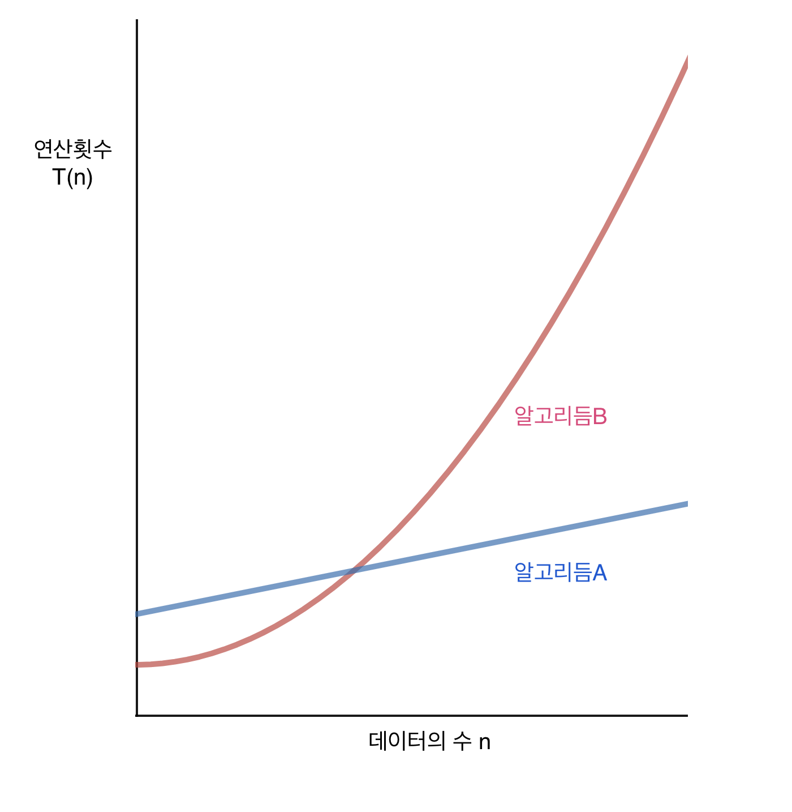

## 자료구조에 대한 기본적인 이해

### 자료구조란 무엇인가?

- 데이터를 표현하고 저장하는 방법을 일컫는다.
- 예컨대, 숫자를 표현하고 저장하기 위한 int형 데이터 구조, 정보의 나열을 저장하기 위한 배열 데이터 구조 등이 있다.
- 자료구조는 기본적으로 다음과 같이 분류 가능하다.
  - 단순구조(정수, 실수, 문자, 문자열)
  - 선형구조(리스트, 스택, 큐)
  - 비선형구조(트리, 그래프)
  - 파일구조(순차파일, 색인파일, 직접파일)

### 자료구조와 알고리듬

- 자료구조가 **데이터의 표현 및 저장방법**을 뜻한다면, 알고리듬은 표현 및 저장된 데이터를 대상으로 하는 **문제의 해결 방법**을 뜻한다.
- 예컨대, 아래 배열 선언은 자료구조적 측면의 코드이다.

```c
int arr[10] = {1, 2, 3, 4, 5, 6, 7, 8, 9, 10};
```

- 반면, 배열에 저장된 모든 값의 합을 더하는 아래 반복문의 구성은 알고리듬적 측면의 코드이다.

```c
int idx = 0;
int sum = 0;
for(idx=0; idx<10; idx++)
	sum += arr[idx];
```

- 위의 반복문은 '배열(자료구조)에 저장된 모든 값의 합을 구하는 알고리듬'이라 할 수 있다.
- 만약 값이 저장된 자료구조가 배열이 아니었으면, 알고리듬은 달라졌을 것이다.
- 자료구조가 결정되어야 그에 따른 효율적인 알고리듬을 결정할 수 있으며, 이와 같이 자료구조와 알고리듬은 밀접한 관계를 가진다.

---

## 알고리듬의 성능분석 방법

### 시간 복잡도(Time Complexity)와 공간 복잡도(Space Complexity)

- 알고리듬은 올바른 동작 여부와 더불어 좋은 성능을 보장할 수 있어야 한다.
- 알고리듬의 성능은 아래 두 가지 요소로 분석 및 평가할 수 있다.
  - **속도** - '어떤 알고리듬이 어떠한 상황 또는 조건에서 **더 빠르거나 느린가**?'
  - **메모리 사용량** - '어떤 알고리듬이 어떠한 상황 또는 조건에서 **메모리를 적게 또는 많이 쓰는가**?
- 속도에 대한 알고리듬 성능 분석결과를 **시간 복잡도(time complexity)**라 하고, 메모리 사용량에 대한 알고리듬 성능 분석 결과를 **공간 복잡도(space complexity)**라고 일컫는다.
- '어떤 알고리듬이 어떠한 상황 또는 조건에서...'라는 부분에 주목할 필요가 있다.
  모든 조건에서 좋은 알고리듬은 존재하지 않는다. 상황에 알맞는 알고리듬을 선택해야 한다.
- 일반적으로 알고리듬을 평가할 때는 메모리 사용량 보다 실행 속도에 초점을 둔다.
- 실행 속도를 평가할 때는 실제 수행 시간을 측정하는 것이 아니라,
  알고리듬에 포함된 연산 횟수를 세고, 처리해야 할 데이터의 수 n에 대한 연산횟수의 함수 T(n)을 구한다.
  **연산 횟수가 적어야 빠른 알고리듬**이다.
- 알고리듬의 연산횟수 함수를 구하면, 그래프를 통해 여러 알고리듬의 시각적 비교가 가능하다.

  

- 위 그래프를 통해 아래와 같은 해석이 가능하다.
  - 데이터 수가 적으면 알고리듬B가 알고리듬A에 비해 더 빠르다.
  - 데이터 수가 많아지면 알고리듬 A가 알고리듬B에 비해 더 빠르다.
  - 데이터 수가 적은 경우 알고리듬B를 사용하고 데이터 수가 많을 경우 알고리듬A를 사용할 수 있다.
  - 데이터 수가 적은 경우 두 알고리듬 간의 차이가 크지 않으니 알고리듬A를 사용할 수 있다.
  - 일반적으로 알고리듬A와 같이 안정적인 성능을 보장하는 알고리듬은 다른 알고리듬에 비해 구현 난이도가 높은 편이다. 따라서 데이터의 수가 많지 않고 성능에 덜 민감해도 되는 경우라면 구현의 편의를 이유로 알고리듬B를 선택할 수 있다.
- 즉, 반복하자면 모든 조건에서 좋은 알고리듬은 존재하지 않는다. 상황에 알맞는 알고리듬을 선택해야 한다.

<span style="font-size: var(--fontSize-0);color: var(--color-text-light);">\*본 글은 도서 '열혈 자료구조(윤성우 저)'를 요약 및 정리한 것 입니다.</span>
