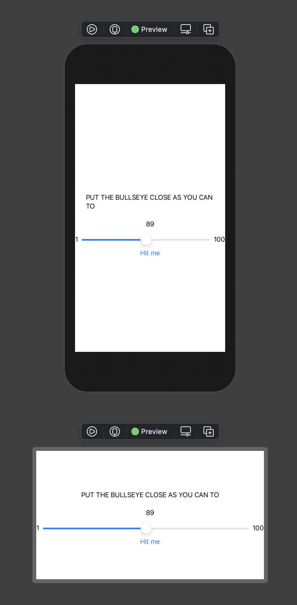
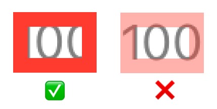

<span style="font-size: var(--fontSize-0);color: var(--color-text-light);">본 글은 raywenderlich.com의 iOS & Swift 강의를 요약 및 정리한 것이다.</span>

---

## SwiftUI vs UIKit

- iOS 개발 IDE는 Xcode를 사용한다.
- iOS Framework로는 기존의 [UIKit](https://developer.apple.com/documentation/uikit)과 최근에 출시한 [SwiftUI](https://developer.apple.com/kr/xcode/swiftui/)가 있다.
- 학습 방향은 SwiftUI를 우선적으로 습득하되, 이후 Legacy 코드를 다루기 위해 UIKit을 학습한다.

---

## SwiftUI Views

- 모든 화면 구성 요소를 `View`라고 부르며, 예로는 `Text View`, `Slider View`, `Vertical Stack View` 등이 있다.
- 하나의 View는 다른 View들의 Container가 될 수 있다.
  예컨대, `Vertical Stack View`는 다른 View를 세로 축으로 정렬하여 포함하는 container view이다.
- SwiftUI를 사용하면 Xcode에서 그래픽 도구 프로그램을 다루듯 WYSIWYG 방식으로 View를 입력할 수 있다. 물론 기본적으로 코드로 입력도 가능하다.
-
- Xcode의 코드 우측 부분에는 Preview가 출력되며, 코드를 통해 다른 비율의 Preview를 추가할 수 있다. 이를 활용하면 Landscape 모드를 함께 확인하며 개발을 진행할 수 있다.

  ```swift
  // ContentView.swift
  ...
  struct ContentView_Previews: PreviewProvider {
    static var previews: some View {
      ContentView()
      ContentView().previewLayout(.fixed(width: 568, height: 320))
    }
  }
  ...
  ```

  

---

## SwiftUI View Modifier

- `Modifier`는 View의 스타일 수정을 담당한다.
- `Modifier`를 실행할 경우 SwiftUI는 대상 View에 스타일을 적용한 새 View를 반환한다.
- 여러 Modifer를 사용할 경우 이전 Modifier가 스타일을 적용하고 반환한 View를 대상으로 다음 Modifier의 스타일이 적용된다.

  ```swift
  Text("100")
    .opacity(0.5)
    .border(Color.red, width: 5)
  ```

  위 코드의 결과는 아래와 같다.

  

  코드가 실행된 순서는 다음과 같다.

  1. `Text("100")` // Text View를 생성
  2. `.opacity(0.5)` // 1번에서 생성한 Text View에 opacity 0.5를 적용한 새 View를 반환
  3. `.border(Color.red, width: 5)` // 2번이 반환한 View에서 border를 적용한 새 View를 반환

- font-weight, text-align 등과 같은 CSS 속성도 `.bold()` , `.multilineTextAlignment(.center)` 와 같은 Modifier를 추가하면 된다.
- 단, View에도 몇 가지 type이 있으며, 몇몇 Modifier는 특정 type의 View에만 적용할 수 있다.
  예컨대, 자간을 설정할 수 있는 `.kerning()` Modifier의 경우 Text View에만 적용 가능하다.
- font size의 경우 `12 point` 와 같이 고정 값을 설정할 수도 있지만, Apple이 제공하는 Dynamic Type Size 값을 사용하는 것이 유리하다.
- iOS의 경우 앱 내에서 font size를 크게 또는 작게 할 수 있는 기능을 제공하는데, Dynamic Type Size를 사용했다면 이를 활용할 수 있다.
  (카카오톡 채팅 글자 크기 조절 기능을 떠올려보라.)
- Dynamic Type Size는 [여기](https://developer.apple.com/design/human-interface-guidelines/ios/visual-design/typography/)에서 확인할 수 있다.
- 예컨대, 13 point를 설정하고자 한다면 Footnote style을 선택하면 된다.

---

##### 참고 예제 코드

````swift
//
//  ContentView.swift
//  Bullseye
//
//  Created by Jinsol on 2021/01/03.
//

import SwiftUI

struct ContentView: View {
  var body: some View {
    VStack {
      Text("PUT THE BULLSEYE CLOSE AS YOU CAN TO")
        .bold()
        .kerning(2.0)
        .multilineTextAlignment(.center)
        .lineSpacing(4.0)
        .font(.footnote)
      Text("89")
      HStack {
        Text("1")
        Slider(value: .constant(50), in: 0.0...100.0)
        Text("100")
      }
      Button(action: {}) {
        Text("Hit me")
      }
      Text("100")
        .opacity(0.5)
        .border(Color.red, width: 5)
    }
  }
}

struct ContentView_Previews: PreviewProvider {
  static var previews: some View {
    ContentView()
    ContentView().previewLayout(.fixed(width: 568, height: 320))
  }
}```
````
